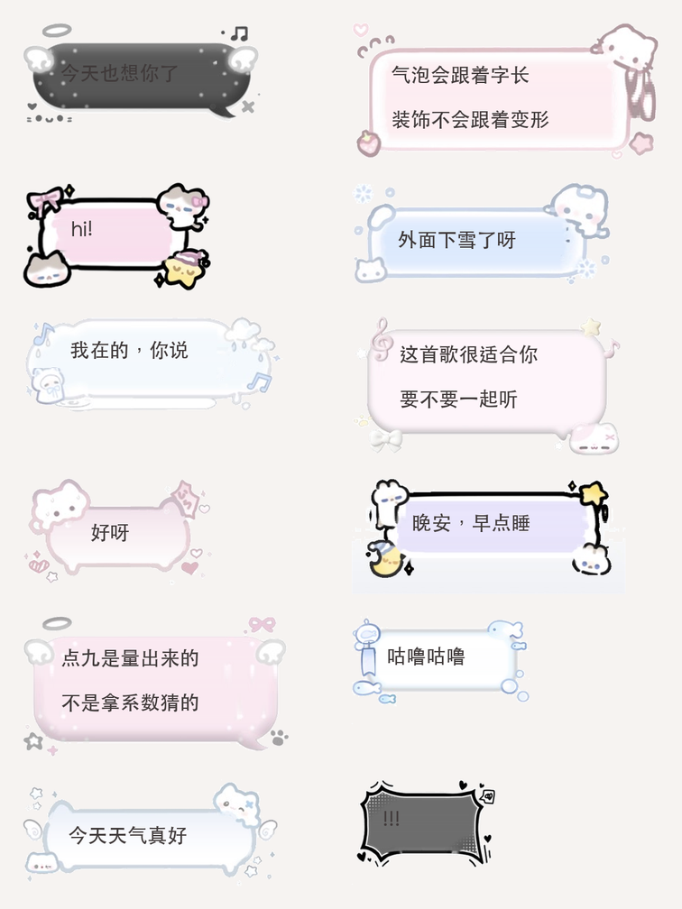

# Cute Bubbles

21 张手绘风聊天气泡，按点九（nine-patch）拉伸 —— **气泡跟着文字长，装饰不跟着变形**。



## 这个仓库解决的问题

聊天气泡贴皮肤，难的从来不是把图贴上去，而是两件事：

**一、框要跟着字长。**
直接把整张图缩放（`Image.resizable().scaledToFit()`）看着没问题，但字一多就漫出框外 ——
图片压根不知道文字有多长。得用点九：四角和四边钉死，只拉中间。

**二、保护区不能靠猜。**
常见写法是拿 `高 × 0.5`、`宽 × 0.36` 这类系数算保护区。套一张图能行，套 21 张必崩 ——
每张图的猫、翅膀、云朵从四边伸进来多少完全不同，结果就是有的字压在装饰上，
有的飘到框外，一拉伸猫脸还会被扯长。

所以这里的点九数据是**一张张量出来的**，量法见下。

## 用起来

### Swift Package

```swift
.package(url: "https://github.com/zaochuanyitian/Cute-bubbles", branch: "main")
```

```swift
import CuteBubbles

let skin = BubbleSkin.all.first { $0.id == "peek-cat" }!

Text(message)
    .padding(skin.contentInsets(mirrored: false))
    .frame(minHeight: skin.minHeight)
    .background {
        BubbleSkinBackground(skin: skin, mirrored: false, bundle: .module)
    }
```

`mirrored: true` 会把整张图水平镜像、并把左右的保护区和内边距对调 —— 用在「对方」那一侧。

选择器里的缩略图用 `BubbleSkinThumbnail(skin:)`，它是整张等比缩放，不切片。

> ⚠️ 点九必须走 `UIImageView`。SwiftUI 的 `Image.resizable()` 会丢掉 `UIImage` 上的
> `capInsets`，整张图跟着一起乱拉。微信、抖音的 iOS 气泡也是这么画的。

### 其他平台

图片在 `Assets/png/`（@3x PNG），数据在 [`bubbles.json`](bubbles.json)：

```json
{
  "id": "halo-gray",
  "file": "halo-gray.png",
  "pixelSize": [426, 180],
  "scale": 3,
  "capInsets":     { "top": 31.3, "leading": 50.3, "bottom": 25.7, "trailing": 51.0 },
  "contentInsets": { "top": 19.0, "leading": 22.0, "bottom": 14.7, "trailing": 22.7 }
}
```

- 单位是 **pt**，图是 @3x，所以 `px = pt × 3`
- `capInsets` → 点九保护区（Android `.9` 图的黑边、CSS `border-image-slice`）
- `contentInsets` → 文字该落在哪（Android `.9` 右边和下边那两条 content 线）
- 数值是按未镜像的图量的；镜像时把 `leading` / `trailing` 对调

## 点九数据是怎么量的

见 [`tools/measure.py`](tools/measure.py)，三步：

**1. 找内壁矩形** —— 从图片正中往外扫，颜色一变就是描边/装饰的起点。
扫的是一条 41 列（或 17 行）的中位色带，图案自带的小圆点骗不停它。

**2. 收边** —— 泡子和装饰同为白色时，上一步会穿过去（雨熊左边只量出 3.7pt，实际有熊）。
所以再逐边往里退，直到整条边都落在干净填充里。这个矩形就是 `contentInsets`。

**3. 挑缝** —— 只留一条窄缝给拉伸，其余全划进保护区：

- **横缝**取内壁中间 40%。上下两条边在那个位置只是描边，横着拉看不出来。
- **竖缝只有 8px，而且不放正中间。** 纵向拉伸等于把缝那几行原地复制，
  左右两列站着猫和翅膀，缝落在眼睛或耳朵上就会扯出竖条纹。
  所以逐行算了一遍两侧的上下起伏，挑最平的一行当缝
  （粉猫 14.8 → 1.6，月亮 40.7 → 10.0）。

换素材后重新量：

```bash
python3 tools/measure.py Assets/png --json bubbles.json   # 出 JSON
python3 tools/measure.py Assets/png --swift               # 出 Swift 数组
```

需要 `pillow` `numpy` `scipy`。

## 已知限制

**月亮（moon-bunny）** 多行时右边那根吊着星星的细线还有轻微拉伸痕迹。
它左右的装饰是细线条，找不到「平坦的一行」可以复制 —— 这是点九的固有限制，
只能改素材（把细线挪到四角）才能根治。其余 20 张多行都干净。

## 许可

**保留所有权利。** 可以读、可以学，但**禁止**二次转载、二次修改、商业使用，
也**禁止**拿这个项目给自己引流或暗示与本项目有关联。

喜欢的话，请直接链接到这个仓库，不要搬走它。

完整条款见 [LICENSE](LICENSE)。
